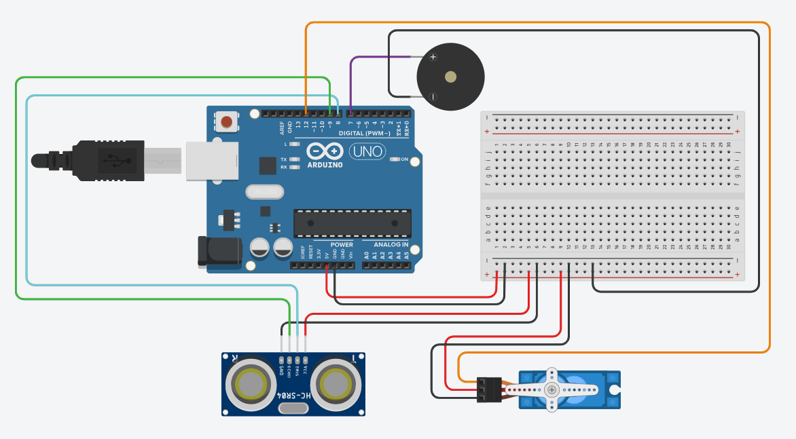
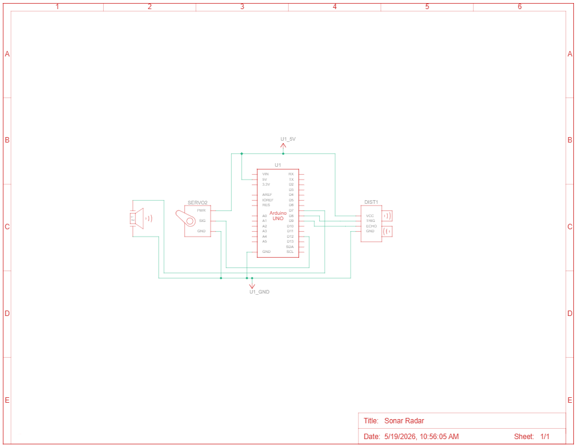

# 📡 Sonar Radar

> An Arduino-based sonar radar system that sweeps an HC-SR04 ultrasonic sensor on a servo motor and visualizes detected objects in real time on a radar-style display built with Processing.


---

## 📖 Overview

The **Sonar Radar** is a two-part project combining an Arduino UNO and a Processing sketch to create a fully functional radar display. The Arduino sweeps an HC-SR04 ultrasonic sensor between 15° and 165° on a servo motor, continuously measuring distance and streaming angle-distance data pairs over serial. The Processing application reads this data and renders a live radar screen — complete with a rotating green sweep line, red object traces, range rings, and a status HUD. A buzzer provides proximity alerts with beep speed proportional to how close an object is.

---

## ✨ Features

- 🔄 **150° servo sweep** — HC-SR04 scans from 15° to 165° and back continuously
- 📺 **Real-time radar display** — Processing renders a green radar screen with concentric range rings and angular grid lines
- 🔴 **Object detection trace** — detected objects within 40 cm are marked with a red line at the correct angle and distance
- 🔔 **Proximity buzzer** — beep rate scales with distance; faster beeps as objects get closer (within 20 cm)
- 📊 **Live HUD** — current angle, distance, and in/out-of-range status shown at the bottom of the display
- 🖥️ **Serial data pipeline** — Arduino streams `angle,distance.` packets; Processing parses and renders each frame

---

## 🛠️ Hardware Components

| Component | Quantity |
|-----------|----------|
| Arduino UNO | 1 |
| HC-SR04 Ultrasonic Sensor | 1 |
| SG90 Servo Motor | 1 |
| Piezo Buzzer | 1 |
| Breadboard | 1 |
| Jumper Wires | As needed |

---

## 💻 Software Requirements

| Software | Purpose |
|----------|---------|
| Arduino IDE (1.8.x or 2.x) | Upload the `.ino` sketch to Arduino |
| Processing 4.x | Run the radar display sketch (`.pde`) |

---

## 🔌 Pin Connections

| Component | Pin | Arduino Pin |
|-----------|-----|-------------|
| HC-SR04 | VCC | 5V |
| HC-SR04 | GND | GND |
| HC-SR04 | TRIG | Digital 8 |
| HC-SR04 | ECHO | Digital 9 |
| Servo Motor | Signal | Digital 12 |
| Servo Motor | VCC | 5V |
| Servo Motor | GND | GND |
| Buzzer | Signal | Digital 7 |
| Buzzer | GND | GND |

---

## 🔌 Circuit Diagram

> Built and simulated in Tinkercad

**Breadboard View:**



**Schematic View:**



---

## 🚀 Getting Started

### 1. Upload the Arduino Sketch

1. Open `Sonar_Radar.ino` in the Arduino IDE
2. Select your board: **Arduino UNO**
3. Select the correct **COM port** and note it down (e.g. `COM5`)
4. Click **Upload**

### 2. Configure the Processing Sketch

Open `Sonar_Radar_Processing.pde` in Processing and update the COM port on **line 21** to match your Arduino:

```java
myPort = new Serial(this, "COM5", 9600); // Change COM5 to your port
```

On **macOS/Linux**, the port will look like:

```java
myPort = new Serial(this, "/dev/ttyUSB0", 9600);
```

### 3. Run the Radar Display

1. Close the Arduino Serial Monitor (it blocks the COM port)
2. Press **Run** in Processing
3. The radar window (1200×700) will open and begin displaying live sweep data

---

## 💻 How It Works

```
Servo sweeps 15° → 165° → 15° (continuously)
              ↓
HC-SR04 measures distance at each degree
              ↓
Arduino sends serial packet: "angle,distance."
              ↓
Processing parses each packet on '.' delimiter
              ↓
   ┌──────────────────────────────────┐
   │        Radar Display             │
   │  Green sweep line at iAngle      │
   │  Red trace if iDistance < 40cm   │
   │  HUD: Angle | Distance | Status  │
   └──────────────────────────────────┘
              ↓
  distance ≤ 20cm? → Buzzer beeps
  (faster beep = closer object)
```

---

## 📡 Serial Data Format

The Arduino streams data in this format, terminated by a period:

```
angle,distance.
```

**Example packets:**

```
90,25.
91,24.
92,40.
```

Processing splits on `,` to extract the angle and on `.` to detect end of packet.

---

## 📁 Project Structure

```
Sonar-Radar/
├── Sonar_Radar.ino                  # Arduino sketch (servo sweep + buzzer)
├── Sonar_Radar_Processing.pde       # Processing sketch (radar display)
├── Sonar_Radar_Circuit.png          # Tinkercad breadboard view
├── Sonar_Radar_Schematic.png        # Tinkercad schematic view
└── README.md
```

---

## 🧠 What I Learned

- Coordinating serial communication between Arduino and a Processing application
- Designing a real-time radar visualization with concentric arcs, angular grid lines, and a sweeping line in Processing
- Using `tone()` with `map()` to create distance-proportional buzzer beep rates
- Parsing structured serial data packets with a custom delimiter scheme (`angle,distance.`)
- Translating physical sensor distance (cm) into pixel coordinates on a 2D display

---

## 🔮 Future Improvements

- Replace the fixed COM port string with an auto-detect or dropdown selector in Processing
- Add colour-coded range zones (green → yellow → red) based on object proximity
- Record and export scan data to a CSV file for analysis
- Upgrade to a 360° rotating platform for full surround scanning
- Use an ESP8266/ESP32 to stream radar data over Wi-Fi to a browser-based display

---

## 👤 Author

**Deep Chatterjee**  
[GitHub](https://github.com/deep-chatterjee)

---

## 📄 License

This project is licensed under the MIT License — see [LICENSE](LICENSE) for details.
